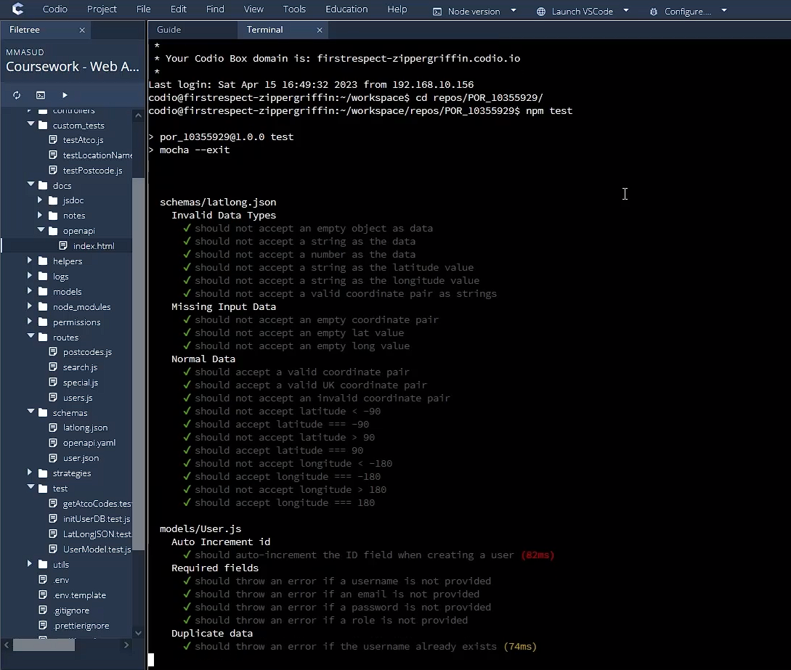
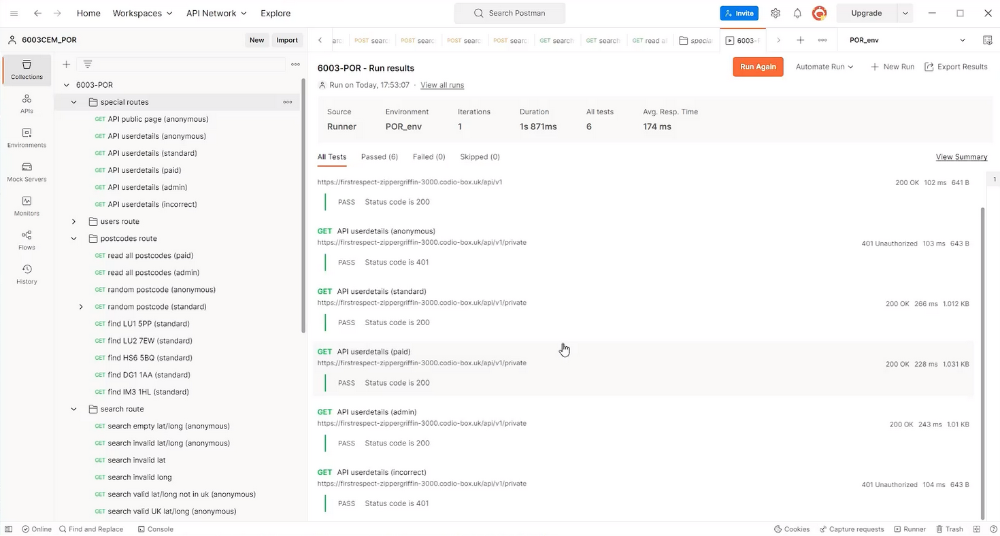
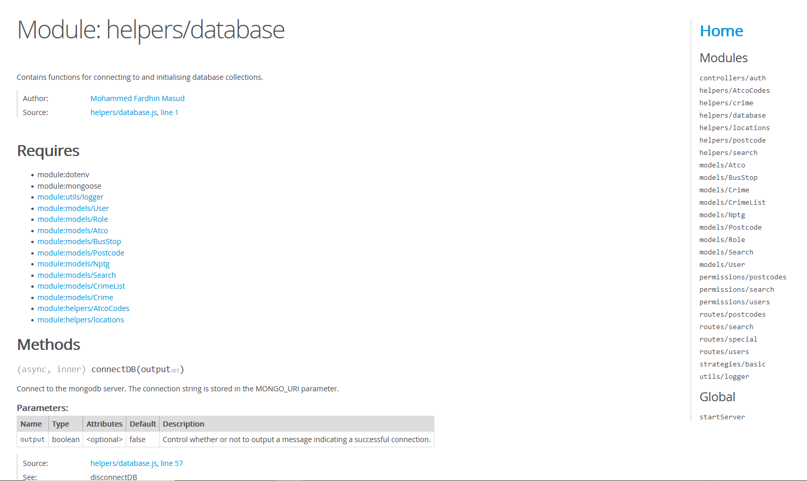

# postcode_stats
This repository holds my improvements to my POR submission for the module **6003CEM - Web API Development**. The original submission can be found here: https://github.coventry.ac.uk/masudm6/improved_POR

Now that I have an infinite amount of time, I can work on the feedback provided by my lecturer:

1. **Testing**: Increase the robustness of tests by:
   - Generating coverage reports to identify untested lines of code.
   - Implementing mocking to conduct fine-grained checks on function arguments.

2. **Caching**: Improve the efficiency and responsiveness of the application by:
   - Implementing cache header setting/checking.
   - Utilising HTTP cache response codes, such as 304 (Not Modified), where appropriate.

3. **Security**: Enhance the security of the application by:
   - Implementing JWT (JSON Web Token) or other token-based authentication (replacing the current basic authentication approach).

In addition to working on the feedback, this project also will also be moving to TypeScript and experiment with other API backends such as Fastify or NestJS. Other improvements that could improve the project, such as continuous integration/deployment, background jobs and test automation will also be experimented with.

## Installation

### Prerequisites
Below are instructions on how to clone and prepare this repository for the project.  
The commands are valid for a system running **Ubuntu 24.04** with `git` installed.
The codio box used to develop this project uses these versions of node and npm:  
- **Node v24.4.1**
- **npm 11.4.2**.    

As part of my project, I also use `MongoDB Atlas`. This provides a mongodb database online (for free), but a local one can also be used for this project. See step 3 below.

### Instructions
To start the server from scratch, open a terminal and follow these instructions:
1. Clone the repository  
   Copy and paste `git clone https://github.com/mfmasud/postcode_stats.git` into the terminal.  
   This uses HTTPS, but you can also use SSH.
2. Switch into the newly cloned repository's directory  
   Type `cd postcode_stats/` to change the current directory.
3. Edit and save the `.env` template  
   Copy and edit `.env.template` with a mongodb database connection string (`DB_STRING`). Save the new filename as `.env`.
4. Install the required packages  
   Run `npm install`. This will install the necessary dependencies.
5. Start the server  
   Type `npm start`. The console should now display the contents of `index.js`, starting the server.

The server is now accessible on the port defined in the `.env` file, **3000** by default.  
**Note:** The initial startup may take time as the data is being initialized for the first time. This can take up to **10 minutes**, as the `Nptg` collection takes time to process. To reduce the time taken to load this, it can safely be commented out from `helpers/database~initLocationDB` (`await getNptgData();`) as it is not necessary for this project to run. However, atco codes will need to be fetched (and cached) once a query for the region is received.

### MongoDB Atlas Bugfixing
- To get the database connection string on **MongoDB Atlas**, select `Database > Connect > Drivers` and copy the string starting with `mongodb+srv://`. Make sure to fill the username and password fields.
- The codio box's public IP address needs to be whitelisted in order to connect to the database. Use `curl ifconfig.me -w "\n"` to return the IP address and add it under `MongoDB Atlas > Security > Network Access`.

## Gallery

## Testing
API Tests were implemented using **Mocha** and **Chai**. Below is an example of the test results:

The API endpoints were tested using Postman with some custom scripts, for example to set JWTs dynamically (in docs/notes/set_jwt.js)

## API Documentation
The API includes an **OpenAPI Specification** and Swagger UI.

And **JSDoc** documentation highlighting dependencies and methods:

