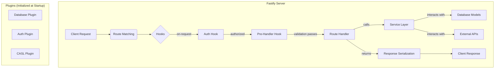

# Fastify Migration Analysis

## Overview

This document analyzes the existing Koa-based **postcode_stats** application and proposes a strategy for migrating to Fastify with TypeScript. The focus is on identifying reusable components, proposing a modern, modular project structure, and outlining the necessary rewrites.

## 1. Analysis of Reusable Components

A significant portion of the existing codebase contains framework-agnostic logic that can be preserved with minimal changes. This accelerates the migration process and reduces risk.

### Low-Impact Components (Largely Reusable)

*   **`helpers/`**: The business logic for interacting with external APIs (postcodes.io, Police API) and data processing is written in plain JavaScript and is not tied to Koa. Modules like `postcode.js`, `crime.js`, and `locations.js` can be migrated into new TypeScript service classes with minor adaptations.
*   **`models/`**: As you suspected, the Mongoose schemas are entirely reusable. Mongoose is compatible with Fastify. For a complete TypeScript migration, we will create TypeScript interfaces corresponding to each schema to ensure type safety across the application. While the schemas are reusable, for future scalability and better type integration, a migration to a TypeScript-first ORM like **Prisma** could be considered post-migration.
*   **`permissions/`**: The permission definitions using `@casl/ability` are framework-agnostic. The core logic defining user roles and abilities can be directly reused. The application of these permissions will be reimplemented using Fastify's hook system instead of Koa middleware.
*   **`schemas/` (JSON Schemas)**: The validation schemas in `schemas/latlong.json` and `schemas/user.json` are highly valuable. Fastify has built-in, high-performance support for JSON Schema validation, allowing these files to be used directly in the new route definitions.
*   **`utils/logger.js`**: The Winston logger configuration is reusable. We will integrate it into the Fastify instance using `fastify.log` for consistent logging.
*   **Configuration Files**: Files like `.env`, `conf.json`, and `.gitignore` are environment-specific or project-specific and do not depend on the web framework.

### High-Impact Components (Requires Rewrite)

*   **`index.js`**: The application entry point will be completely rewritten to initialize a Fastify server instead of a Koa one.
*   **`routes/`**: All route definitions in `routes/*.js` are built for `@koa/router`. These will be rewritten using Fastify's routing syntax. This is an opportunity to reorganize them into a more modular structure.
*   **`controllers/auth.js`**: This file contains Koa-specific authentication middleware. This logic will be migrated to a Fastify authentication plugin, likely using `@fastify/passport` and `@fastify/jwt`.
*   **`strategies/`**: While the core logic of the Passport.js strategies is reusable, their integration will be updated from `koa-passport` to `@fastify/passport`.
*   **`test/`**: Integration and API tests targeting the Koa endpoints will need a complete rewrite to target the new Fastify routes and use a Fastify-compatible testing framework like `tap` or `jest` with `fastify.inject()`. Unit tests for helper functions may be reusable.

## 2. Proposed Architecture for Fastify

To address issues like scattered middleware and improve maintainability, we propose a modular, feature-based architecture. All new code will reside in a `src/` directory and be written in TypeScript.

### Proposed Project Structure

```
postcode_stats/
├── src/
│   ├── app.ts                         # Main Fastify app setup, registers plugins and routes
│   ├── server.ts                      # Server bootstrap (listens on port)
│   ├── plugins/                       # Core Fastify plugins
│   │   ├── db.ts                      # Mongoose/Prisma connection
│   │   ├── auth.ts                    # Authentication setup (JWT, Passport)
│   │   ├── casl.ts                    # CASL ability integration
│   │   └── swagger.ts                 # OpenAPI documentation generator
│   ├── modules/                       # Feature-based modules
│   │   ├── users/
│   │   │   ├── user.routes.ts         # User-related route definitions
│   │   │   ├── user.controller.ts     # Route handlers (replaces logic from routes/users.js)
│   │   │   ├── user.service.ts        # Business logic (from helpers/)
│   │   │   ├── user.model.ts          # Mongoose schema (from models/User.js)
│   │   │   ├── user.schema.ts         # Validation schemas (from schemas/user.json)
│   │   │   └── user.types.ts          # TypeScript types and interfaces
│   │   ├── postcodes/                 # (similar structure for postcodes)
│   │   ├── search/                    # (similar structure for search)
│   │   └── special/                   # (similar structure for special routes)
│   └── common/                        # Shared utilities
│       └── logger.ts                  # Winston logger instance (from utils/logger.js)
├── test/
│   └── ...                            # Rewritten tests
└── package.json                       # Updated dependencies for Fastify, TS, etc.
```

### Key Architectural Improvements

*   **Modular Design**: Each feature (Users, Postcodes) is self-contained in its own directory within `src/modules/`, containing its routes, controllers, services, and schemas. This follows the "Enforce Modular Design" rule.
*   **Centralized Plugins**: Core functionalities like database connections, authentication, and authorization are handled by dedicated Fastify plugins in `src/plugins/`. This solves the problem of scattered middleware, consolidating logic from `controllers/auth.js`, `strategies/`, and `permissions/` into a cohesive system.
*   **Clear Separation of Concerns**:
    *   **Controllers** (`*.controller.ts`): Handle HTTP requests and responses.
    *   **Services** (`*.service.ts`): Contain the core business logic, decoupled from the framework.
    *   **Models** (`*.model.ts`): Define the data structure.
*   **Type Safety**: The entire codebase will be in TypeScript, with explicit types for models, API requests/responses, and service layers, adhering to the "Type-Strict Development" principle.

### New Data Flow

The proposed Fastify architecture streamlines the request lifecycle using plugins and hooks.



This architecture provides a robust, scalable, and maintainable foundation for the **postcode_stats** API, leveraging the performance and developer experience benefits of Fastify and TypeScript. 