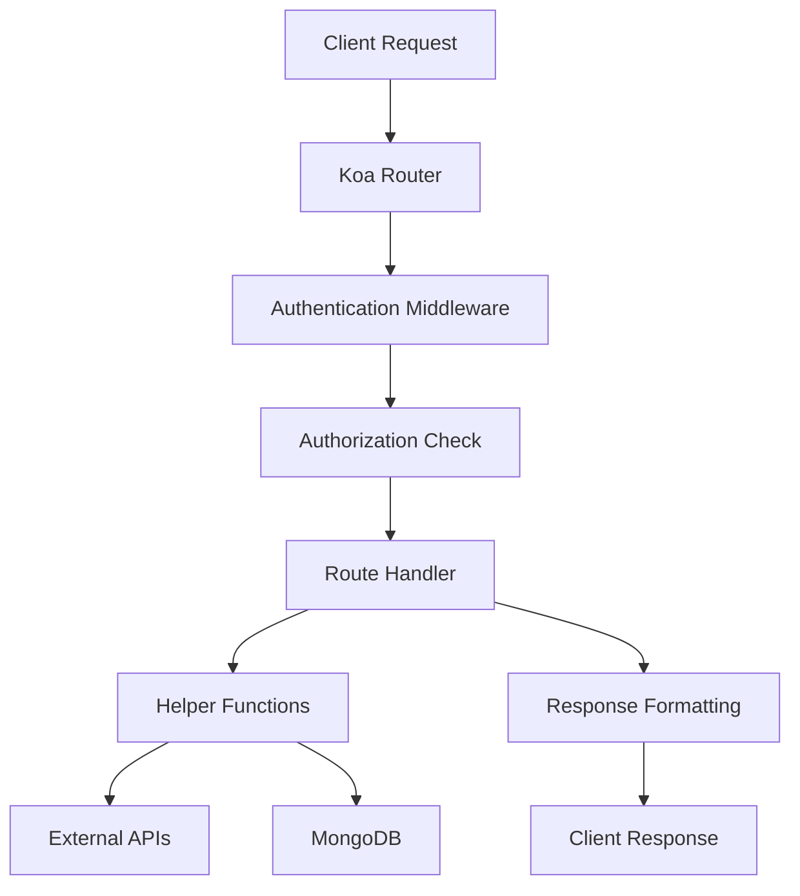

# Koa-based Infrastructure Breakdown

## Overview

This document provides a comprehensive breakdown of the current Koa-based infrastructure for the **postcode_stats** API. This analysis supports the upcoming migration to TypeScript and the transition away from Koa to a modern framework.

## Project Structure

### Migration Related Files and Folders

```
postcode_stats/
├── controllers/                       # Authentication middleware
│   └── auth.js                        # Passport authentication controller
├── custom_tests/                      # Additional test files
│   ├── testAtco.js                    # ATCO code testing
│   ├── testLocationNames.js           # Location name testing
│   └── testPostcode.js                # Postcode validation testing
├── helpers/                          # Business logic and database operations
│   ├── AtcoCodes.js                  # ATCO code processing and management
│   ├── crime.js                      # Police API integration and crime data
│   ├── database.js                   # Database connection and initialization
│   ├── locations.js                  # Geographic data processing
│   ├── postcode.js                   # Postcode.io API integration
│   └── search.js                     # Search functionality and data aggregation
├── models/                           # Mongoose database schemas
│   ├── Atco.js                       # ATCO transport data model
│   ├── BusStop.js                    # Bus stop location model
│   ├── Crime.js                      # Individual crime record model
│   ├── CrimeList.js                  # Aggregated crime statistics model
│   ├── Nptg.js                       # National Public Transport Gazetteer model
│   ├── Postcode.js                   # UK postcode data model
│   ├── Role.js                       # User role and permissions model
│   ├── Search.js                     # Search result and caching model
│   └── User.js                       # User account and authentication model
├── permissions/                      # CASL-based authorization rules
│   ├── postcodes.js                  # Postcode access permissions
│   ├── search.js                     # Search functionality permissions
│   └── users.js                      # User management permissions
├── routes/                           # API route definitions
│   ├── postcodes.js                  # Postcode management endpoints
│   ├── search.js                     # Search functionality endpoints
│   ├── special.js                    # Special routes (public, login, private)
│   └── users.js                      # User management endpoints
├── schemas/                          # JSON validation schemas
│   ├── latlong.json                  # Latitude/longitude validation schema
│   ├── openapi.yaml                  # Complete OpenAPI specification
│   └── user.json                     # User data validation schema
├── strategies/                       # Passport authentication strategies
│   ├── basic.js                      # HTTP Basic authentication strategy
│   └── jwt.js                        # JWT token authentication strategy
├── test/                             # Unit and integration tests
│   ├── getAtcoCodes.test.js         # ATCO code helper tests
│   ├── initUserDB.test.js           # Database initialization tests
│   ├── LatLongJSON.test.js          # Latitude/longitude validation tests
│   └── UserModel.test.js            # User model validation tests
├── utils/                            # Utility functions
│   └── logger.js                     # Winston logging configuration
├── .gitignore                        # Git ignore patterns
├── .node-version                     # Node.js version specification
├── .prettierrc.json                  # Prettier code formatting configuration
├── conf.json                         # Application configuration
├── index.js                          # Application entry point and server startup
├── package.json                      # Node.js dependencies and scripts
├── pnpm-lock.yaml                    # pnpm package lock file
└── README.md                         # Project documentation and setup guide
```

### Directory Overview

| Directory | Purpose | File Count | Key Technologies |
|-----------|---------|------------|------------------|
| `controllers/` | Authentication middleware | 1 | Passport.js, Koa |
| `custom_tests/` | Additional testing utilities | 3 | Custom test scripts |
| `helpers/` | Business logic modules | 6 | External APIs, Data processing |
| `models/` | Database schemas | 9 | Mongoose, MongoDB |
| `permissions/` | Authorization rules | 3 | CASL ability framework |
| `routes/` | API endpoint definitions | 4 | Koa Router, HTTP methods |
| `schemas/` | Validation schemas | 3 | JSON Schema, OpenAPI |
| `strategies/` | Authentication strategies | 2 | Passport strategies |
| `test/` | Unit and integration tests | 4 | Mocha, Chai, Sinon |
| `utils/` | Utility functions | 1 | Winston logging |

**Total Migration-Relevant Files: 36 code files + 9 configuration files = 45 files**

## Technology Stack

### Core Framework & Runtime
- **Node.js v24.4.1** - JavaScript runtime
- **Koa v3.0.1** - Web framework 
- **@koa/router v13.1.1** - Routing middleware
- **koa-bodyparser v4.4.1** - Request body parsing
- **koa-passport v6.0.0** - Authentication middleware

### Database & ODM
- **mongoose v8.17.0** - MongoDB object modeling
- **MongoDB Atlas** - Cloud database service

### Authentication & Authorization
- **passport-jwt v4.0.1** - JWT authentication strategy
- **passport-http v0.3.0** - HTTP Basic authentication strategy
- **passport-anonymous v1.0.1** - Anonymous user strategy
- **@casl/ability v6.7.3** - Authorization and permissions
- **jsonwebtoken v9.0.2** - JWT token generation
- **bcrypt v6.0.0** - Password hashing

### Validation & Data Processing
- **ajv v8.17.1** - JSON schema validation
- **validator v13.15.15** - String validation library
- **csvtojson v2.0.10** - CSV to JSON conversion

### HTTP Client & External APIs
- **axios v1.11.0** - HTTP client for external API calls

### Utilities & Tools
- **winston v3.17.0** - Logging framework
- **logform v2.7.0** - Log formatting
- **dotenv v17.2.1** - Environment variable management
- **jsdom v26.1.0** - DOM manipulation for server-side

### Development & Testing
- **mocha v10.8.2** - Test framework
- **chai v4.5.0** - Assertion library
- **chai-as-promised v8.0.1** - Promise assertion
- **sinon v21.0.0** - Test spies, stubs, and mocks
- **nodemon v3.1.10** - Development server
- **prettier v3.6.2** - Code formatting
- **jsdoc v4.0.4** - Documentation generation

### Documentation
- **redoc v2.5.0** - API documentation rendering

## API Routes Structure

### Base URL: `/api/v1`

#### 1. Special Routes (`/api/v1`)
**File**: `routes/special.js`

| Method | Endpoint | Auth Required | Description |
|--------|----------|---------------|-------------|
| GET | `/` | No | Public API welcome message |
| GET | `/private` | Yes | User details endpoint (testing) |
| GET | `/login` | No | JWT token generation endpoint |

**Key Features**:
- Public API entry point
- JWT token generation for testing
- User authentication verification

#### 2. User Management (`/api/v1/users`)
**File**: `routes/users.js`

| Method | Endpoint | Auth Required | Permissions | Description |
|--------|----------|---------------|-------------|-------------|
| GET | `/` | Yes | Admin only | Get all users |
| POST | `/` | No | Public | Create new user (registration) |
| GET | `/:id` | Yes | User/Admin | Get user by ID |
| PUT | `/:id` | Yes | User/Admin | Update user by ID |
| DELETE | `/:id` | Yes | User/Admin | Delete user by ID |

**Key Features**:
- Role-based access control using CASL
- Password hashing with bcrypt
- Email validation
- User profile management

#### 3. Postcode Management (`/api/v1/postcodes`)
**File**: `routes/postcodes.js`

| Method | Endpoint | Auth Required | Permissions | Description |
|--------|----------|---------------|-------------|-------------|
| GET | `/` | Yes | Admin only | Get all cached postcodes |
| GET | `/random` | Yes | Authenticated | Get random postcode |
| GET | `/:postcode` | Yes | Authenticated | Get specific postcode |

**Key Features**:
- Integration with postcodes.io API
- Postcode validation and caching
- Support for UK postcode format

#### 4. Search Functionality (`/api/v1/search`)
**File**: `routes/search.js`

| Method | Endpoint | Auth Required | Permissions | Description |
|--------|----------|---------------|-------------|-------------|
| GET | `/` | Yes | Authenticated | Search by lat/lng coordinates |
| POST | `/` | Yes | Authenticated | Search by postcode |
| GET | `/random` | Yes | Admin only | Random postcode search |

**Key Features**:
- Coordinate-based and postcode-based searching
- Integration with multiple external APIs
- Bus stop and crime data aggregation
- Search result caching

## Database Models (Mongoose Schemas)

### Core Models

#### 1. User Model (`models/User.js`)
```javascript
{
  id: Number (unique),
  firstName: String,
  lastName: String,
  username: String (required, unique),
  about: String,
  dateRegistered: Date (default: now),
  password: String (required, hashed),
  passwordSalt: String,
  email: String (required, unique, validated),
  role: ObjectId (ref: "Role", required)
}
```

#### 2. Role Model (`models/Role.js`)
```javascript
{
  name: String (enum: ["none", "user", "paiduser", "admin"]),
  description: String
}
```

#### 3. Postcode Model (`models/Postcode.js`)
```javascript
{
  postcode: String (required),
  eastings: Number,
  northings: Number,
  country: String (required),
  longitude: Number (required),
  latitude: Number (required),
  region: String,
  parliamentary_constituency: String,
  admin_district: String,
  admin_ward: String,
  parish: String,
  admin_county: String
}
```

#### 4. Search Model (`models/Search.js`)
```javascript
{
  searchID: Number,
  latitude: Number (required),
  longitude: Number (required),
  Northing: String (required),
  Easting: String (required),
  reverseLookup: Boolean (default: false),
  Postcode: ObjectId (ref: "Postcode"),
  queryBusStops: [ObjectId] (ref: "BusStop"),
  queryCrimes: [ObjectId] (ref: "Crime"),
  linkedATCO: ObjectId (ref: "Atco"),
  linkedCrimeList: ObjectId (ref: "CrimeList"),
  _links: Object (HATEOAS links)
}
```

### Supporting Models

#### 5. BusStop Model (`models/BusStop.js`)
- ATCO codes and coordinates
- Bus stop metadata from NAPTAN API

#### 6. Crime Model (`models/Crime.js`)
- Crime data integration
- Location-based crime statistics

#### 7. Atco Model (`models/Atco.js`)
- ATCO (Association of Transport Coordinating Officers) data
- Transport network information

#### 8. Nptg Model (`models/Nptg.js`)
- National Public Transport Gazetteer data

#### 9. CrimeList Model (`models/CrimeList.js`)
- Aggregated crime statistics

## Authentication & Authorization Architecture

### Authentication Strategies

#### 1. JWT Strategy (`strategies/jwt.js`)
- **Purpose**: Token-based authentication
- **Implementation**: passport-jwt
- **Token Expiry**: 1 hour
- **Secret**: Environment variable `JWT_SECRET`
- **Header**: Bearer token in Authorization header

#### 2. Basic Strategy (`strategies/basic.js`)
- **Purpose**: Username/password authentication
- **Implementation**: passport-http
- **Password Verification**: bcrypt comparison
- **Fallback**: For legacy authentication support

#### 3. Anonymous Strategy
- **Purpose**: Allow unauthenticated access to public endpoints
- **Implementation**: passport-anonymous

### Authorization System

#### Permission Management (`permissions/`)
- **Framework**: @casl/ability
- **Files**: 
  - `permissions/users.js` - User management permissions
  - `permissions/postcodes.js` - Postcode access permissions
  - `permissions/search.js` - Search functionality permissions

#### Role-Based Access Control
- **none**: No special permissions
- **user**: Basic authenticated user
- **paiduser**: Enhanced user privileges
- **admin**: Full system access

## Helper Modules

### Core Helpers (`helpers/`)

#### 1. Database Operations (`helpers/database.js`)
- Database connection management
- Initial data seeding
- Collections initialization

#### 2. Postcode Operations (`helpers/postcode.js`)
- postcodes.io API integration
- Postcode validation and lookup
- Random postcode generation
- Coordinate-to-postcode conversion

#### 3. Search Operations (`helpers/search.js`)
- Bus stop data retrieval
- Crime data aggregation
- ATCO code linking
- HATEOAS link generation

#### 4. Location Services (`helpers/locations.js`)
- Geographic data processing
- Coordinate system conversions

#### 5. ATCO Code Management (`helpers/AtcoCodes.js`)
- Transport network data processing
- Bus stop code management

#### 6. Crime Data Processing (`helpers/crime.js`)
- Police API integration
- Crime statistics aggregation

## Validation Schemas

### JSON Schema Files (`schemas/`)

#### 1. Latitude/Longitude Validation (`schemas/latlong.json`)
- Coordinate range validation
- Geographic bounds checking

#### 2. User Data Validation (`schemas/user.json`)
- User registration validation
- Profile update validation

#### 3. OpenAPI Specification (`schemas/openapi.yaml`)
- Complete API documentation
- Request/response schemas
- Authentication requirements

## Configuration & Environment

### Environment Variables
- `DB_STRING`: MongoDB connection string
- `JWT_SECRET`: JWT signing secret
- `PORT`: Server port (default: 3000)

### Configuration Files
- `.env`: Environment variables
- `conf.json`: Application configuration
- `package.json`: Dependencies and scripts

## External API Dependencies

### Primary APIs
1. **postcodes.io**: UK postcode lookup and validation
2. **Police Data API**: Crime statistics by location
3. **NAPTAN API**: Public transport access nodes
4. **NPTG API**: National public transport gazetteer

### Data Flow


## Logging & Error Handling

### Logging Framework
- **Library**: Winston v3.17.0
- **Configuration**: `utils/logger.js`
- **Log Levels**: Error, Warn, Info, Debug
- **Output**: Console and file-based logging

### Error Handling Strategy
- **HTTP Status Codes**: Standard RESTful responses
- **Error Middleware**: Koa error handling
- **Validation Errors**: AJV schema validation
- **Authentication Errors**: Passport middleware

## Testing Infrastructure

### Test Framework
- **Primary**: Mocha + Chai
- **Async Testing**: chai-as-promised
- **Mocking**: Sinon.js
- **Coverage**: Built-in Mocha coverage

### Test Categories
- **Unit Tests**: Individual function testing
- **Integration Tests**: API endpoint testing
- **Authentication Tests**: Login/authorization flows
- **Database Tests**: Model validation and CRUD operations

## Migration Considerations for TypeScript

### High Priority Areas
1. **Type Definitions**: All models need TypeScript interfaces
2. **Route Handlers**: Strongly typed request/response objects
3. **Database Schemas**: Mongoose + TypeScript integration
4. **Authentication**: Typed user objects and permissions
5. **External APIs**: Typed response interfaces

### Framework Migration Targets
- **NestJS**: Recommended for enterprise-grade TypeScript APIs
- **Fastify**: High-performance alternative with TypeScript support
- **Express + TypeScript**: Minimal migration path

### Breaking Changes to Address
1. **Async/Await**: Convert all Promise-based code
2. **Error Handling**: Implement typed error classes
3. **Validation**: Migrate from AJV to class-validator or Zod
4. **Configuration**: Type-safe configuration management
5. **Database**: Consider TypeORM or Prisma over Mongoose

## Security Considerations

### Current Security Measures
- Password hashing with bcrypt (10 salt rounds)
- JWT token expiration (1 hour)
- Role-based access control with CASL
- Input validation with AJV schemas
- MongoDB injection protection via Mongoose

### Areas for Enhancement
- Rate limiting implementation
- CORS configuration
- Request sanitization
- API key management for external services
- Enhanced JWT security (refresh tokens)

---

**Document Version**: 1.0  
**Last Updated**: TypeScript Migration Planning Phase  
**Authors**: Migration Planning Team 
